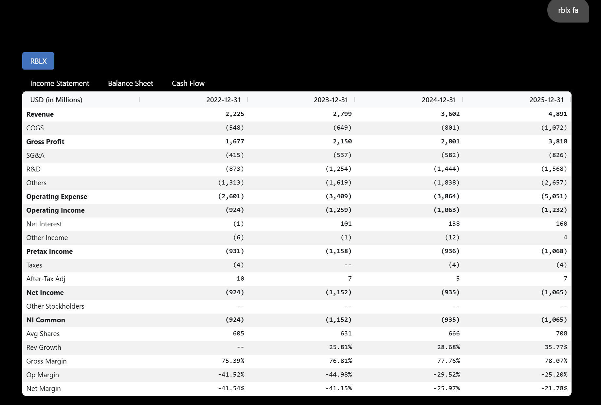
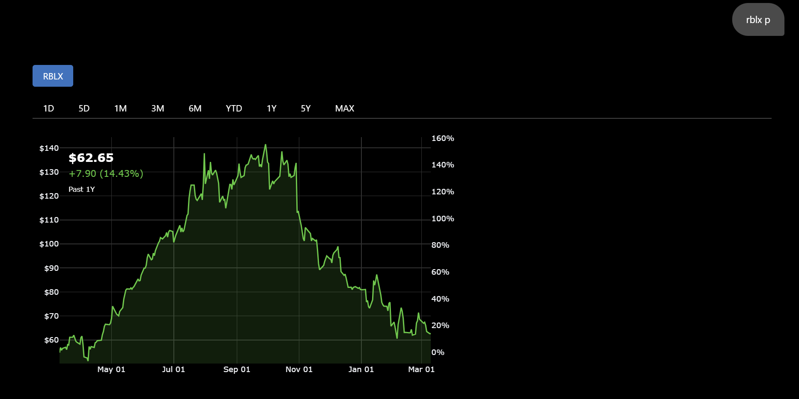
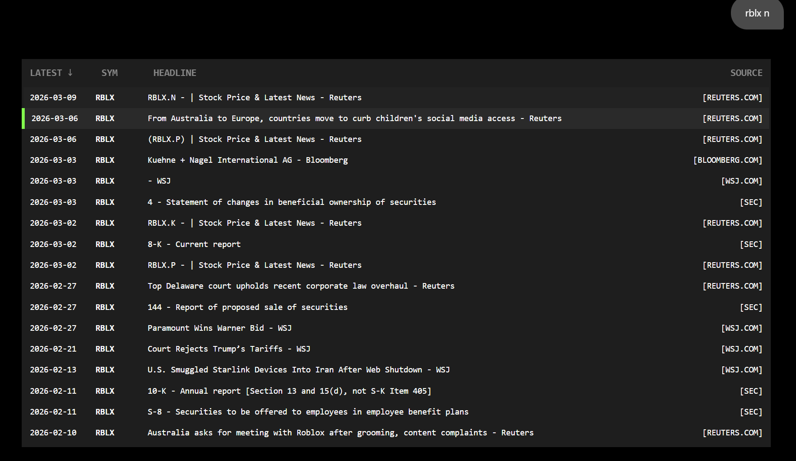

for testing and learning concepts, so alot of stuff are scuffed (especially data arch). not finalised version.   
improved version of current data pipeline/arch [here](https://github.com/soonyz06/Barra)

# Data Analysis
* [EDA](src/feature)
  - Basic plots: Missing heatmap, histograms, qq, corr, boxplot
  - More plots: PCA, importances, shap, network graphs, etc
  - OLS plots: Predicted vs Actual, Resid vs Fitted, qq plot, cook's distance, vif, etc
  - Time series: ADF, KPSS, ACF, PACF, etc

 # Broomburg
 
 * Uses dash for most of it (vibe coded)
 * Registry pattern to parse and execute commands
 * Able to auto populate [spreadsheets](data/output/fa_models) for DCF
 
 
 
 
- Potential for semantic chunking and storing in vector database for RAG and stuff

# stuff
* Factor Models
  - R_{i,t}  -R_{f,t} = a_{i} + B_{i,1}F_{1,t} + ... + B_{i,k}F_{k,t} + e_{i,t} (factor loading)
  - regression of asset returns on factor returns (time-series regression)
  - R_{i,t} - R_{f,t} = λ_{0,t} + λ_{1,t}B_{i,1} + λ_{k,t}B_{k,1} + n_{i,t} (risk premia)
  - regression of asset returns on factors characteristics (cross-sectional regression)
  - B = Cov/Var is equivalent to a specific case of OLS
  - Z-normalised scores can also be used proxy for factor exposures (B)
  - Used in risk models and hedging in order to isolate idio alpha and remove unwanted exposures
  - Used in performance attribution to see how much of the returns are from exposure to systematic factors vs resid (alpha + error)
* Risk
  - [Vol](src/utils/risk.py): Close to close, yang zhang and garch  

