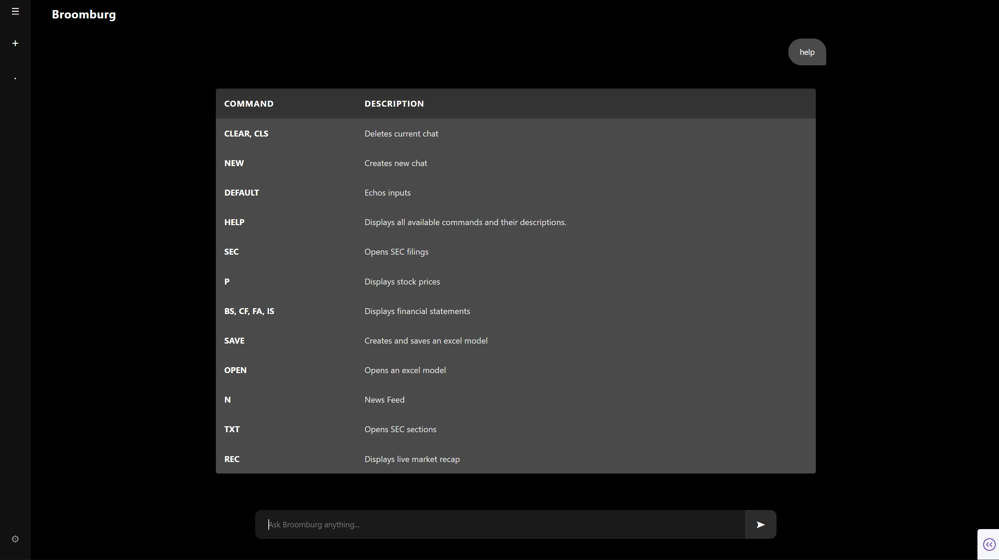

# model

# Data Pipeline
* Tabular data stored as parquet files using [PM](src/io/parquet.py)
  - Batch I/O operations with constraints on max row group & file sizes 
  - Chunks written to new files each time + Scheduled Compact jobs 
  - Partitioning, versioning, backups, stores metadata(ts, source), etc
* Data potentially from various sources
  - yahooquerry, tiingo, sec, rss, fred, alpha vantage, etc
 
# Data Analysis
* EDA
  - Basic plots: Missing, histograms, qq, corr, pca, importances, network graphs, etc
  - OLS plots: Predicted vs Actual, Resid vs fitted, qq, cook, vif, etc
  - Time series: ADF, KPSS, ACF, PACF, etc
* Feature
  - Feature processing: Imputation, winsor, normlisation, power transform, vector embeddings, etc

 # Broomburg
 
 * Uses dash for front-end and some back-end
 * Registry pattern to parse and execute commands

# Stuff
* Factor Models
  - R_{i,t}-R_{f,t} = a_{i} + B_{i,1}F_{1,t} + ... + B_{i,k}F_{k,t} + e_{i,t} (factor loading)
  - regression of asset returns on factor returns (time-series regression)
  - R_{i,t}-R_{f,t} = λ_{0,t} + λ_{1,t}B_{i,1} + λ_{k,t}B_{k,1} + n_{i,t} (risk premia)
  - regression of asset returns on factors characteristics (cross-sectional regression)
  - B = Cov/Var is equivalent to a specific case of OLS
  - Z-normalised scores can also be used proxy for factor exposures (B)
  - Used in risk models and hedging to isolate idio alpha and remove unwanted exposures
  - Used in performance attribution to see how much of returns are from exposure to factors vs (alpha+error)
* Risk
  - [Vol](src/utils/risk.py): Close to close, yang zhang and garch

