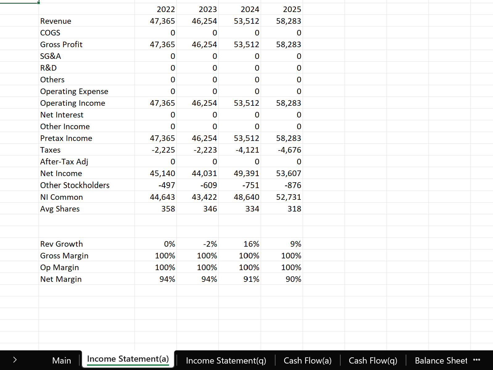

for me to test and learn concepts, so alot of stuff are scuffed, 

# Data Engineering
  - Polars: Lazy query plan, hive partitioning, batch I/O operations, file sizing, versioning, compact jobs, schema enforcement, etc
  - Potential improvements: Last updated+different logic for new and update, bloom filter, negative caching, write-rename, binary search retry, never overwrite(w ts) and unified log. 
  - Planning to scrap and redo the entire thing
# Data Analysis
* EDA
  - Basic plots: Missing heatmap, histograms, qq, corr, boxplot
  - More plots: PCA, importances, shap, network graphs, etc
  - OLS plots: Predicted vs Actual, Resid vs Fitted, qq plot, cook's distance, vif, etc
  - Time series: ADF, KPSS, ACF, PACF, etc
* [Previous implementation](https://github.com/soonyz06/Broomburg_Prototype) 
  
 # Broomburg
 
 * Uses dash for web application (vibe coded cuz i aint learning webdev)
 * Registry pattern to parse and execute commands
 
 
 
 
- Data standardised
 
- Potential for semantic chunking and storing in vector database for RAG and stuff

# Risk
  - [Vol](src/utils/risk.py): Close to close, yang zhang and garch  

